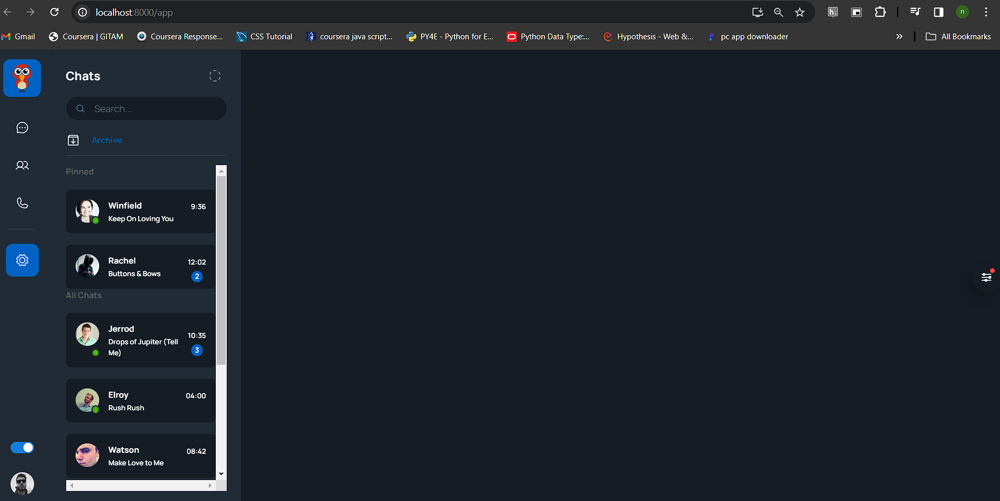
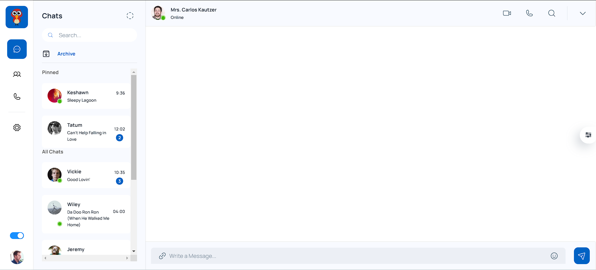

# ReactJS Chat Application

This project is a chat application developed using ReactJS. It allows users to communicate with each other in real-time.

## Introduction

The ReactJS Chat Application is a modern web-based chat platform designed to facilitate seamless communication between users. Built with ReactJS, it offers a responsive and intuitive user interface, providing features such as real-time messaging, user authentication, and message persistence.

### Features

- Real-time messaging: Instantly send and receive messages.
- User authentication: Securely log in and authenticate users.
- Message persistence: Messages are stored and retrieved for seamless chat history.
- Responsive design: Works flawlessly across devices of all sizes.

## Development Phases

### Phase 1 and 2: UI

- **Screenshot:** Developed the NavBar and chat history
  

### Phase 3: UI

- **Screenshot:** Developed Chat Room Area
  

